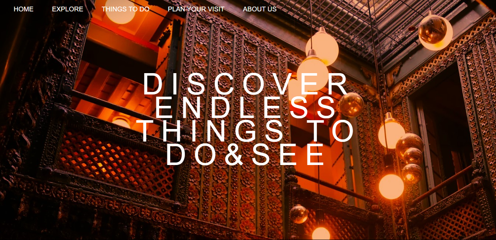
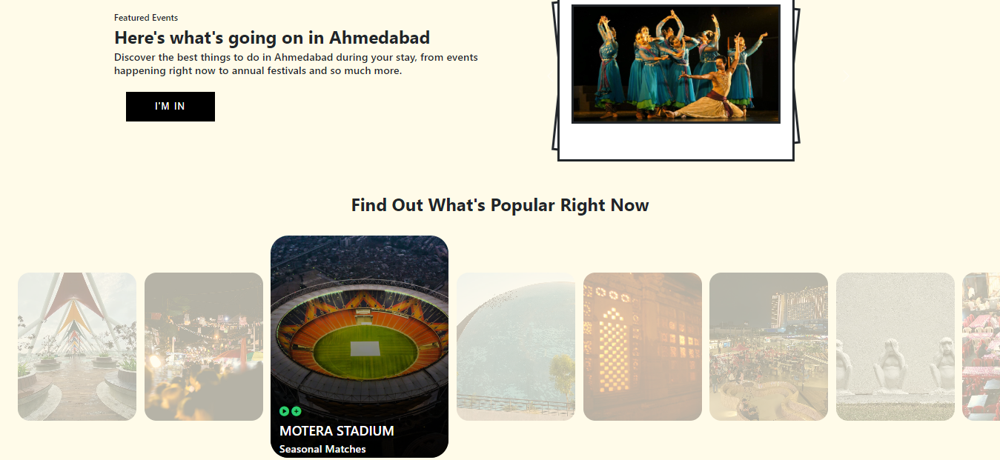
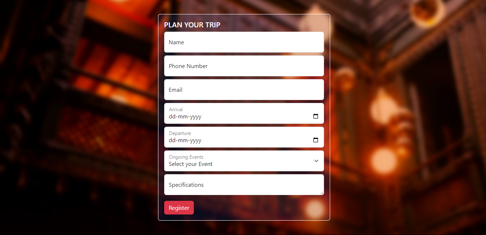
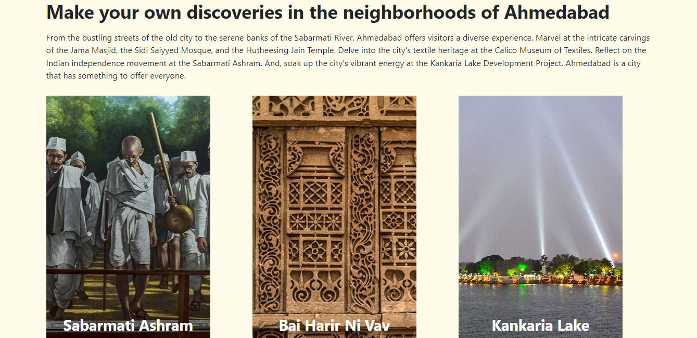

# Ahmedabad-Tourism-Site
Welcome to the Ahmedabad Tourism Website repository! This project is a simple and elegant static website built using HTML and CSS to showcase the various tourist attractions in Ahmedabad, India.
# Features
* Home Page: Overview of Ahmedabad and highlights of top attractions.
* Explore Page: Detailed descriptions and images of various tourist places.
* Things to do Page: A collection of all ongoing and upcoming events and activities.
* Plan your visit Page: Contains the form to make reservations and bookings for the trip.
# Technologies Used
* HTML: For structuring the content.
* CSS: For styling the website.
# Website Overview

